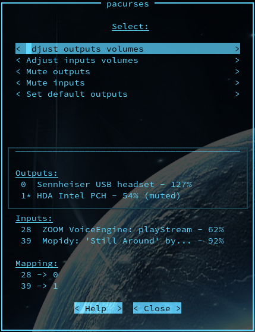
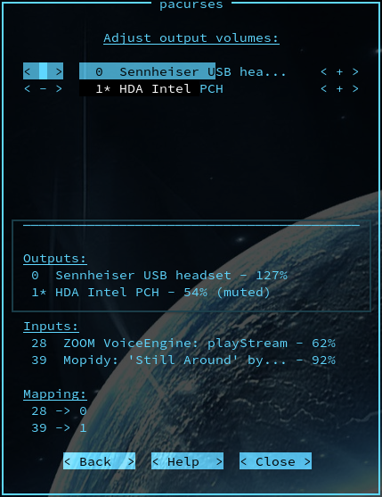

# Pacurses

A curses graphical interface to the
[PulseAudio](https://www.freedesktop.org/wiki/Software/PulseAudio) sound system
for the terminal.




## Installation

### PulseAudio

In the end, `pacurses` is only a graphical interface which is using `pacmd`
to communicate with the _PulseAudio_ daemon. Therefore make sure that both are
installed and running on your machine.

- [ArchLinux](https://wiki.archlinux.org/index.php/PulseAudio#Installation)
- [Ubuntu](https://wiki.ubuntu.com/PulseAudio)
- ...

### Pacurses

Install it globally with [pip](https://pip.pypa.io/en/stable):

```shell
$ pip install pacurses
```

Execute always the most recent version with [pipx](https://pipxproject.github.io/pipx/):

```shell
$ pipx run pacurses
```
